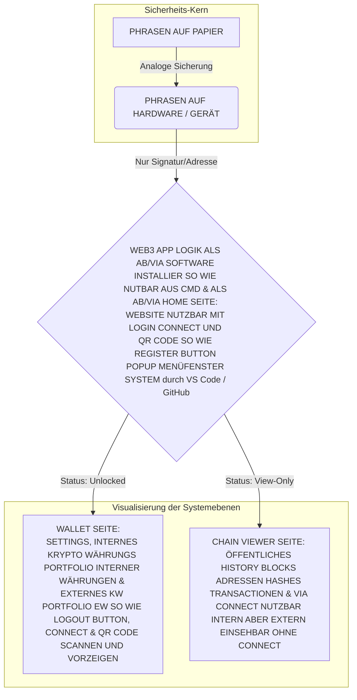

# 4Wallet-Konzept

### 1. Die Entwicklungs-Struktur (Source Repository)

Dies ist dessen Arbeitsverzeichnis in VS Code, in dem die gesamte Programmlogik liegt, bevor sie in Code-Artefakte umgewandelt wird.


```
/4wallet-source
├── /src
│   ├── /core
│   │   ├── bip39-handler.ts      # Logik zur Verifizierung der Seed-Phrasen (lokal)
│   │   ├── handshake-manager.ts  # Steuerung der Verbindung (QR/Hardware)
│   │   └── signature-engine.ts   # Mathematische Signatur-Logik (isoliert)
├── /blockchain             # NEU: Smart Contract & Blockchain-Logik
│   │   ├── contract-manager.ts # Steuerung: Mint, Burn, Wrap, Bridge
│   │   ├── block-processor.ts  # Logik für Block-Struktur (#10, #11, Hashes, Nonce)
│   │   └── cross-chain.ts      # Logik für Token-Bridge (ETH/TON/Mainnet/Testnet)
│   ├── /components
│   │   ├── login-popup.tsx       # UI für den initialen Connect/Register-Button
│   │   ├── settings-menu.tsx     # UI zur Verwaltung/Löschung von Verbindungen
│   │   ├── qr-scanner.tsx        # UI-Komponente für den QR-Handshake
│   │   └── contract-ui.tsx     # UI-Buttons: Mint, Burn, Wrap, Bridge
│   ├── /hooks
│   │   ├── use-wallet-state.ts   # Zustand (isLoggedIn, address, isConnected)
│   │   ├── use-connection-manager.ts # Listener für Session-Events
│   │   └── use-contract.ts     # Hook zum Ausführen von Mint/Burn/Bridge
│   ├── /services
│   │   ├── coingecko-api.ts      # Preis-Daten für BTC/ETH/TON
│   │   ├── blockchain-fetcher.ts # Datenabruf von der Blockchain (Read-Only)
│   │   └── admin-provider.ts   # NEU: Berechtigungs-Layer für dich als Admin
│   ├── /store                    # NEU: Zentraler Zustand für das gesamte System
│   │   └── wallet-store.ts       # Speichert die 'Connected'-Liste & Login-Status
│   │
│   └── /utils                    # NEU: Hilfsfunktionen für Transaktionen & Formate
│       ├── formatters.ts         # Konvertierung von Wei zu ETH/BTC (Lesbarkeit)
│       └── transaction-helper.ts # Erstellung von Transaktions-Payloads
│
├── /public
│   ├── favicon.ico
│   └── logo-rfof.svg             # Branding für das Netzwerk
├── package.json
├── package-lock.json
└── tsconfig.json
```

---

### 2. Die Generierungs-Struktur (Build/Artefakt-Verzeichnis)

Dies ist der Ordner, der durch den Befehl `npm run build` generiert wird. Er enthält nur das, was für den Browser (dein "Sichtfenster") optimiert ist.

```markdown
/4wallet-dist
├── /assets            # Gebündelte und komprimierte Assets
│   ├── index-A7b2.css # Styles für die Home-Seite
│   ├── wallet-F9x1.css# Styles für die Wallet-Sicht
│   └── main-D4k9.js   # Die gesamte kompilierte Logik aus /src/core, /src/hooks, /src/store
├── /chunks            # Dynamisch geladene Modul-Logik für Performance-Optimierung
│   ├── handshake.js   # Enthält handshake-manager.ts & qr-scanner.tsx (wird nur bei Bedarf geladen)
│   ├── chain-data.js  # Enthält blockchain-fetcher.ts & coingecko-api.ts (für Chain-Viewer)
│   └── wallet-ui.js   # Enthält settings-menu.tsx & wallet-store.ts (für Wallet-Seite)
├── index.html         # Verlinkt: [main-D4k9.js, index-A7b2.css]
├── wallet.html        # Verlinkt: [wallet-ui.js, main-D4k9.js]
└── chain-viewer.html  # Verlinkt: [chain-data.js, main-D4k9.js]
```

---

### 3. Die Deployment-Struktur (Public Web-Repository)

Dies ist die Struktur, die auf dem Server (z.B. GitHub Pages oder Vercel) live geht. Sie spiegelt die Berechtigungsstufen des 4Wallet-Konzept (@RFOF-NETWORK) Systems wieder.

```markdown
/4wallet-live
├── /index.html        # Einstiegspunkt: Öffentliche Home-Seite
├── /wallet            # Geschützter Bereich (Redirect auf Login, falls unverbunden)
│   ├── index.html     # Wallet-Dashboard & Settings-UI
│   └── settings.js    # Logik für Verbindungs-Management (Verbindungen trennen)
└── /chain-explorer    # Öffentlich einsehbarer Bereich für öffentliche Daten
    ├── index.html     # Block-Viewer & Adress-Suche
    └── api-proxy.js   # Read-only Schnittstelle zu den Blockchains

```

---

### Technische Synergie: Vom Code zum Deployment

Die Magie deines Systems geschieht durch die **Build-Pipeline** (eingesteuert über `npm`):

* **Der Link:** Dein `package.json` im Quell-Verzeichnis definiert Scripte, die bei jedem `git push` automatisch den `/dist` Ordner aus dem `/source` Ordner berechnen.
* **Der Schutz:** Da die `core`-Logik im `/src`-Ordner bei der Generierung in `minified` (komprimiertes) JavaScript umgewandelt wird, ist dein Code effizient und sicher, da er für Außenstehende schwer lesbar bleibt.
* **Die UI-Trennung:** Die Navigation zwischen `index.html` (Home), `wallet.html` (intern) und `chain-explorer.html` (extern) wird durch einen **Router** innerhalb deiner TypeScript-Logik gesteuert, der den Status `isLoggedIn` abfragt, bevor der Nutzer Zugriff auf die sensiblen Settings erhält.

Durch diesen Aufbau stellt @RFOF-NETWORK sicher, dass VS Code-Projekte sauber bleiben, während der Deployment-Bereich nur das enthält, was für die Web-App zur Darstellung notwendig ist.



1.tens LOGIN & REGISTER BUTTON SIND NUR IN HOME SEITE VORHANDEN!

2.tens LOGOUT UND SETTINGS BITTON SIND NUR IN WALLET SEITE VORHANDEN!

3.tens QR CODE IST IN HOME SEITE & IN WALLET SEITE VORHANDEN!

4.tens CONNECT IST IN HOME SEITE, IN WALLET SEITE & IN CHAIN VIEWER SEITE VORHANDEN!

EINSEHEN VON VERBUNDENEN CONNECTIONS SIND IN SETTINGS VORHANDEN UND KÖNNEN DORT GETRENNT WERDEN FALLS MAN WELCHE

ANGENOMMEN HAT DIE DADURCHDOET ALS VERBUNDEN GEKENZEICHNET SIND, GESPEICHER SOMIT WIEDERVERWENDET SOBALD EINMAL GENUTZT 

SO WIE GELÖSCHT WERDEN


Node.js (npm) ist haupt werkzeug das dafur installiert wurde!
