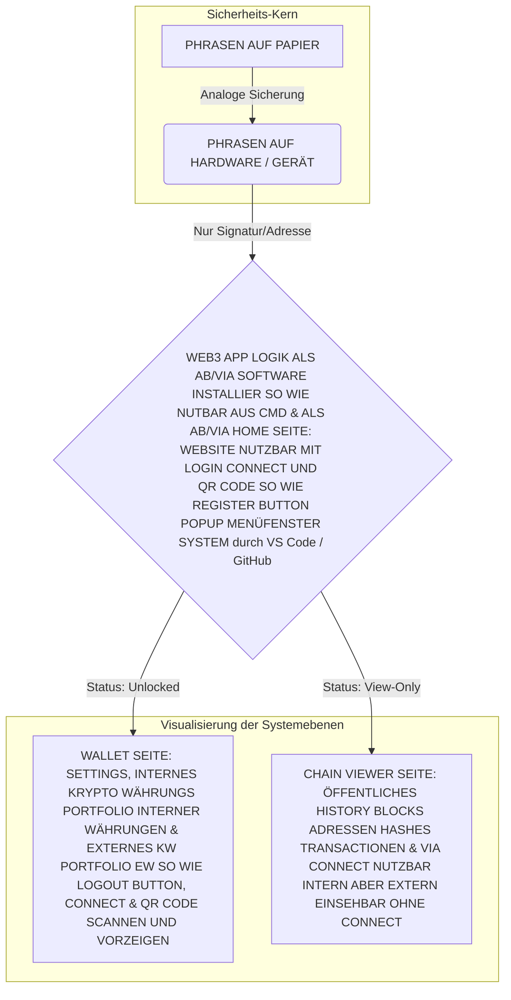

# 4Wallet-Konzept

1.tens LOGIN & REGISTER BUTTON SIND NUR IN HOME SEITE VORHANDEN!

2.tens LOGOUT UND SETTINGS BITTON SIND NUR IN WALLET SEITE VORHANDEN!

3.tens QR CODE IST IN HOME SEITE & IN WALLET SEITE VORHANDEN!

4.tens CONNECT IST IN HOME SEITE, IN WALLET SEITE & IN CHAIN VIEWER SEITE VORHANDEN!

EINSEHEN VON VERBUNDENEN CONNECTIONS SIND IN SETTINGS VORHANDEN UND KÖNNEN DORT GETRENNT WERDEN FALLS MAN WELCHE

ANGENOMMEN HAT DIE DADURCHDOET ALS VERBUNDEN GEKENZEICHNET SIND, GESPEICHER SOMIT WIEDERVERWENDET SOBALD EINMAL GENUTZT 

SO WIE GELÖSCHT WERDEN

Node.js (npm) ist haupt werkzeug das dafur installiert wurde!
